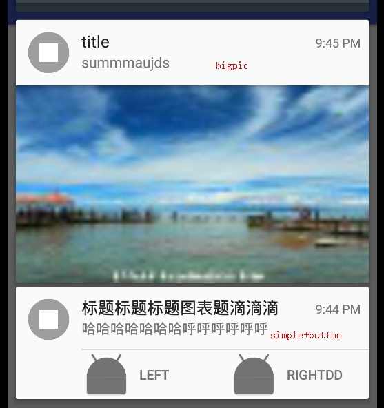
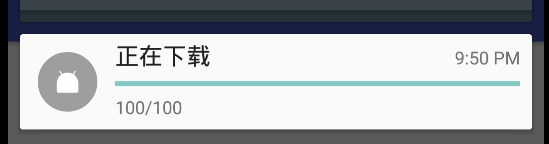
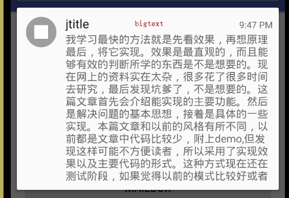
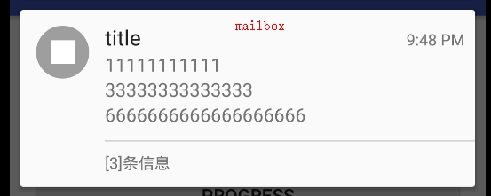
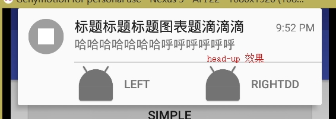

# NotifyUtil

notification工具类,最简化api

# 示例图


 


 


 


 


 

# API

## Application里的初始化

```
public static void init(Context appContext)
```


## 第一步:

```
buildSimple(int id,int icon,CharSequence contentTitle ,CharSequence contentText,PendingIntent contentIntent)
  
buildProgress(int id,int icon,CharSequence contentTitle,int progress,int max)
 
 buildBigPic(int id,int icon,CharSequence contentTitle,CharSequence contentText,CharSequence summaryText)
 
 buildBigText(int id,int icon,CharSequence contentTitle,CharSequence contentText)
 
 buildMailBox(int id,int icon,CharSequence contentTitle)
 
// buildMedia(int id,int icon,CharSequence contentTitle,CharSequence contentText)//todo 
  
```

## 第二步:其他可选设置

默认情况下:

只有呼吸灯提示


```
设置三类intent:

setContentIntent(PendingIntent contentIntent)
setDeleteIntent(PendingIntent deleteIntent)
setFullScreenIntent(PendingIntent fullscreenIntent)

添加按钮:
addBtn(int icon,CharSequence text,PendingIntent pendingIntent)
开启head-up模式
setHeadup()
//提示语,默认为"您有新的消息"
setTicker(CharSequence ticker)
//大小图标
setSamllIcon(int smallIcon)
setBigIcon(int bigIcon)
//优先级,默认为default
setPriority(int priority)
//设置成为不可删除
setOnGoing()
//提示模式:默认情况下只有呼吸灯提示
setAction(boolean sound, boolean vibrate, boolean lights)
//设置为前台服务的notification
setForgroundService() 
//锁屏显示的控制(默认不显示)
setLockScreenVisiablity(int lockScreenVisiablity)
  VISIBILITY_PRIVATE : 显示基本信息，如通知的图标，但隐藏通知的全部内容 
  VISIBILITY_PUBLIC : 显示通知的全部内容 
  VISIBILITY_SECRET : 不显示任何内容，包括图标
```

## 第三步

```
.show()
```


 ## 取消

```
cancel(int id)
cancelAll()
```

# 使用

## gradle

**Step 1.** Add the JitPack repository to your build file

Add it in your root build.gradle at the end of repositories:

```
    allprojects {
        repositories {
            ...
            maven { url "https://jitpack.io" }
        }
    }
```

**Step 2.** Add the dependency

```
    dependencies {
            compile 'com.github.hss01248:NotifyUtil:1.0.0'
    }
```


## 示例代码

```
 NotifyUtil.buildSimple(100,R.mipmap.ic_launcher,"标题标题标题图表题滴滴滴","哈哈哈哈哈哈哈呼呼呼呼呼呼",null)
                        .setHeadup()
                        .addBtn(R.mipmap.ic_launcher,"left", NotifyUtil.buildIntent(MainActivity.class))
                        .addBtn(R.mipmap.ic_launcher,"rightdd", NotifyUtil.buildIntent(MainActivity.class))
                        .show();
        
NotifyUtil.buildBigPic(101,R.drawable.timg,"title","content","summmaujds")
                        .setPicRes(R.drawable.timg2)
                        .show();
                        
 NotifyUtil.buildProgress(102,R.mipmap.ic_launcher,"正在下载",progresses,100).show();
 
 NotifyUtil.buildMailBox(104,R.drawable.timg,"title")
                        .addMsg("11111111111")
                        .addMsg("33333333333333")
                        .addMsg("6666666666666666666")
                        .show();

NotifyUtil.buildBigText(103,R.drawable.timg,"jtitle","我学习最快的方法就是先看效果，" +
                        "再想原理最后，将它实现。效果是最直观的，而且能够有效的判断所学的东西是不是想要的。" +
                        "现在网上的资料实在太杂，很多花了很多时间去研究，最后发现坑爹了，不是想要的。" +
                        "这篇文章首先会介绍能实现的主要功能。然后是解决问题的基本思想，接着是具体的一些实现。" +
                        "本篇文章和以前的风格有所不同，以前都是文章中代码比较少，附上demo,但发现这样可能不方便读者，" +
                        "所以采用了实现效果以及主要代码的形式。这种方式现在还在测试阶段，如果觉得以前的模式比较" +
                        "好或者其他更好的方式的话可以給我留言，以后的文章会做出相应的调整 。").show();
```